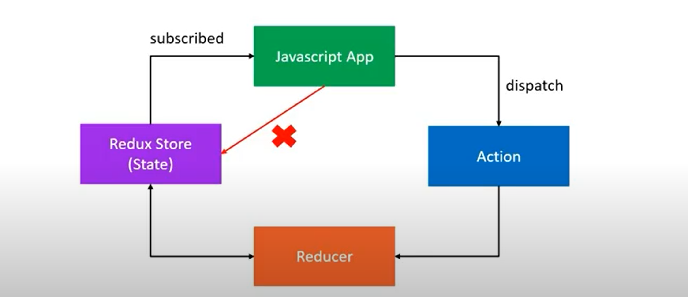
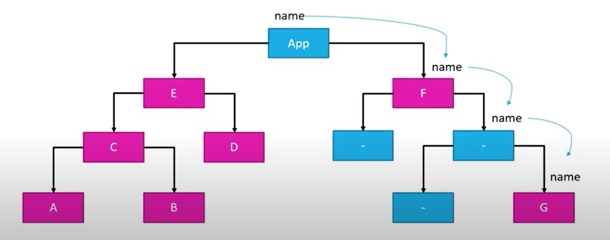
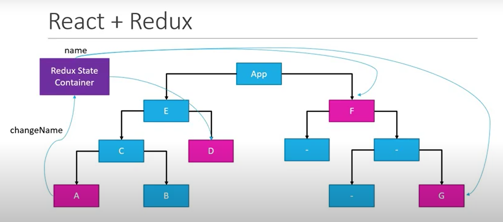
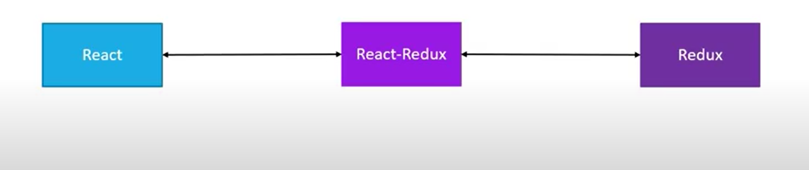

# Redux- basics

## Redux
 1. It is a predictable state container for javascript apps
 2. Redux is for JavaScript application
    * Redux is not tied to React
    * Can be used with React, Angular. Vue or even vanilla JavaScript
 3. Redux is a state container
    * Redux stores the state of your application
    * Consider a React app - state of a component, State of an app is the state represented by the individual components of that app, Redux will store and mange the application state.
 4. Redux is predictable 
    * Redux is a state container
    * The state of an application can change
    * In redux, all state transitions are explicit and it is possible to keep track of them

## Three Principles
<p align="center">
   
</p>

 1. The state of your whole application is stored in an object tree within a single store
    * Maintain our application state in a single object which would be managed by Redux store
 2. The only way to change the state is to emit an action, an object describing what happened
    * To update the state of your app, you need to let Redux know about that with an action
    * Not allowed to directly update the state object
 3. To specify how state tree is transformed by actions, you write pure reducers
    * Reducer-(previousState,action)==> newState

## Actions
 1. The only way your application can interact with the store
 2. Actions are in 2 type
    * Synchronous :- As soon as an action was dispatched, the state was immediately updated
    * Ex: if you dispatch the BUY_CAKE action, the numOFCakes was right away decremented by 1. Same with BUY_ICECREAM action as well.
      ```js
         const BUY_CAKE = 'BUY_CAKE'

         function buyCake(){
            return {
               type: BUY_CAKE,
               info: 'First redux action'
            }
         }
      ```
    * Asynchronous :- Asynchronous API calls to fetch data from an end point and use that data in your application
    * Ex: 
      ```js
         const fetchUsers = () => {
            return function(dispatch){
               axios.get('https://jsonplaceholder.typicode.com/users')
                .then(response => {
                   // response.data is the array of users
                })
                .catch(error => {
                   // error.message is the error description
                })
            }
         }
      ```
 3. Carry some information from your app to the redux store
 4. Plain JavScript object
 5. Have a `type` property that indicates the type of action being performed
 6. The `type` property is typically defined as string constants

## Reducers
 1. Specify how the app's state changes in response to action sent to the store
 2. Function that accepts state and action as arguments, and returns the next state of the application
   ```js
      // (previousState, action) => newState

      const initialState = {
          numOfCakes: 10
      }

      const reducer = (state = initialState, action) =>{
          switch(action.type) {
              case BUY_CAKE: return {
                  ...state,
                  numOfCakes: state.numOdCakes -1
              }
              default: return state
          }
      }
   ```
## Redux Store
 1. Holds application state
 2. Allow access to state via `getState()`
 3. Allow state to be updated via `dispatch(action)`
 4. Registers listeners via `subscribe(listener)`
 5. Handles registering of listeners via the function returned by `subscriber(listener)`
   ```js
      const redux = require('redux)
      const createStore = redux.createStore

      const store = createStore(reducer)
      console.log('Initial state', store.getState())
      const unsubscribe = store.subscribe(() => console.log('Updated state',store.getState()))
      store.dispatch(buyCake())
      store.dispatch(buyCake())
      store.dispatch(buyCake())
      unsubscribe()
   ```
##  Middleware
 1. Is the suggested way to extend Redux with custom functionality
 2. Provides a third-party extension point between dispatching an action, and the moment it reaches the reducer
 3. Use middleware for logging, crash reporting, performing asynchronous tasks etc
   ```js
      const reduxLogger = require('redux-logger)
      const logger = reduxLogger.createLogger()

      const applyMiddleware = redux.applyMiddleware

      const store = createStore(rootReducer,applyMiddleware(logger))
   ```

## React + Redux
<p align="center">
   
</p>

 1. In React state will store within the component and if React component A having the field named as name which is required for its sibling B then we have to pass it by it's parent C then it sends to B, similarly component F and G requires the field then this situation is very hectic for react to mange.
<p align="center">
   
</p>

 2. In order to solve we have to use hooks(useReducer + useContext) or Redux. Redux with store the React state in Redux State Container
<p align="center">
   
</p>

 3. In order to bind the React and Redux with need React-Redux which is the official Redux UI binding library for React
    * Connect
      * The connect() function connects a React component to a Redux store.
      * It provides its connected component with the pieces of the data it needs from the store, and the functions it can use to dispatch actions to the store.
      * It does not modify the component class passed to it; instead, it returns a new, connected component class that wraps the component you passed in. 
      * `function connect(mapStateToProps?, mapDispatchToProps?, mergeProps?, options?)`
        * mapStateToProps?: (state, ownProps?) => Object
          * If a mapStateToProps function is specified, the new wrapper component will subscribe to Redux store updates. This means that any time the store is updated, mapStateToProps will be called. The results of mapStateToProps must be a plain object, which will be merged into the wrapped component’s props. If you don't want to subscribe to store updates, pass null or undefined in place of mapStateToProps
        * mapDispatchToProps?: Object | (dispatch, ownProps?) => Object
          * Conventionally called mapDispatchToProps, this second parameter to connect() may either be an object, a function, or not supplied.Your component will receive dispatch by default, i.e., when you do not supply a second parameter to connect()
            ```js
                  function CakeContainer(props) {
                     console.log(props)
                     return (
                        <div>
                              <h2>Number of Cakes( using connect) - { props.numOfCakes }  </h2>
                              <button onClick={props.buyCake }>Buy Cake</button>
                        </div>
                     )
                  }

                  // Takes the redux state
                  const mapStateToProps = state => {
                     return {
                        // numOfCakes: state.numOfCakes
                        numOfCakes: state.cake.numOfCakes
                     }
                  }

                  const mapDispatchToProps = dispatch => {
                     return {
                        buyCake: () => dispatch(buyCake())
                     }

                  }

                  export default connect(
                     mapStateToProps,
                     mapDispatchToProps
                  )(CakeContainer)
            ```

    * Provider
      * The `<Provider />` makes the Redux store available to any nested components that have been wrapped in the connect() function.
      * Since any React component in a React Redux app can be connected, most applications will render a `<Provider>` at the top level, with the entire app’s component tree inside of it
      * Normally, you can’t use a connected component unless it is nested inside of a` <Provider>`.

## React Redux + Hooks
 1. React Redux pattern
 2. Action creators, reducers, provide the store and connect the component
 3. Component can access state and dispatch actions
 4. React Redux v7.1 , Subscribe to store and dispatch actions without connect()

    * Hooks
      * useSelector() 
        * The selector is approximately equivalent to the mapStateToProps argument to connect conceptually. The selector will be called with the entire Redux store state as its only argument. The selector will be run whenever the function component renders (unless its reference hasn't changed since a previous render of the component so that a cached result can be returned by the hook without re-running the selector). useSelector() will also subscribe to the Redux store, and run your selector whenever an action is dispatched. 
      * useDispatch()
        * This hook returns a reference to the dispatch function from the Redux store. You may use it to dispatch actions as needed
        * Note: like in React's useReducer, the returned dispatch function identity is stable and won't change on re-renders (unless you change the store being passed to the `<Provider>`, which would be extremely unusual).
         ```js
            function HooksCakeContainer() {
               // const numOfCakes = useSelector(state => state.numOfCakes)
               const numOfCakes = useSelector(state => state.cake.numOfCakes)
               const dispatch = useDispatch()
               return (
                  <div>
                        <h2>Number of cakes (using Hooks) - {numOfCakes}</h2>
                        <button onClick={()=>dispatch(buyCake())}>Buy cake</button>
                  </div>
               )
            }
        ```

## Ref
 * https://react-redux.js.org/api/provider
 * https://react-redux.js.org/api/connect
 * https://react-redux.js.org/api/hooks
