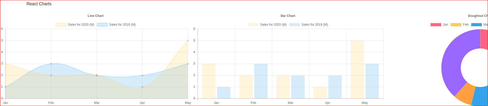

# Practical React

## Icons
  <p align="center">
       
  </p>
  
``` javascript 
import './App.css';
import React from 'react'

import { Divider } from 'antd';
import 'antd/dist/antd.css'

import {IconContext} from 'react-icons'
import { FaReact } from 'react-icons/fa'
import { MdAlarm } from 'react-icons/md'


function App() {

    return (
        <div className="App">
            <IconContext.Provider value={{color:'blue',size:'5rem'}}>
                <Divider orientation="left"> React Icons </Divider>
                {/* <FaReact color='purple' size='10rem' />
                <MdAlarm color='purple' size='10rem' /> */}
                <FaReact />
                <MdAlarm />
            </IconContext.Provider>   
        </div>  
  );
}

export default App;
```

## Toasts
  <p align="center">
       
  </p>
  
``` javascript 
import './App.css';
import React from 'react'

import { Divider } from 'antd';
import 'antd/dist/antd.css'

import { toast } from 'react-toastify'
import 'react-toastify/dist/ReactToastify.css'

toast.configure()

const CustomToast = ({ closeToast }) => {
  return (
    <div>
      This is Custom Toast
      <button onClick={closeToast}>Close</button>
    </div>
  )
}

const notify = () => {
  toast('Basic notification!',{
    position: toast.POSITION.TOP_LEFT
  })
  toast.success('Success notification!',{
    position: toast.POSITION.TOP_CENTER,
    autoClose:8000
  })
  toast.info('Info notification!',{
    position: toast.POSITION.TOP_RIGHT
  })
  toast.warn('Warning notification!',{
    position: toast.POSITION.BOTTOM_LEFT,
    autoClose:false
  })
  toast.error(<CustomToast />,{
    position: toast.POSITION.BOTTOM_CENTER
  })
  toast('Basic notification!',{
    position: toast.POSITION.BOTTOM_RIGHT
  })
}


function App() {
  return (

    <div className="App">

      <Divider orientation="left"> React Toasts </Divider> 
      <button onClick={notify}>Notify!</button>
     
    </div>
   
  );
}

export default App;
```

## Modal
  <p align="center">
       
  </p>
  
``` javascript 
import './App.css';
import React, { useState } from 'react'

import { Divider } from 'antd';
import 'antd/dist/antd.css'

import Modal from 'react-modal'

function App() {

  const [modalIsOpen, setModalIsOpen] = useState(false)
    return (

    <div className="App">
      <Divider orientation="left"> React Modal </Divider> 
      <button onClick={() => setModalIsOpen(true)}>Open Modal</button>
      <Modal 
        isOpen = {modalIsOpen}
        onRequestClose ={() => setModalIsOpen(false)}
        shouldCloseOnOverlayClick = {false}
        style = {
          {
            overlay: {
              background: 'grey'
            },
            content: {
              color: 'orange'
            }
          }
        }
      >
        <h2>Modal Title</h2>
        <p>Modal Body</p>
        <button onClick={() => setModalIsOpen(false)}>Close</button>
      </Modal>
     
    </div>
   
  );
}

export default App;
```

## Tooltip
  <p align="center">
       
  </p>
  
``` javascript 
import './App.css';
import React, { forwardRef } from 'react'

import { Divider } from 'antd';
import 'antd/dist/antd.css'

import Tippy from '@tippy.js/react'
import 'tippy.js/dist/tippy.css'

const CustomToolTip = forwardRef((props,ref) => {
  return (
    <div ref={ref}>
      <div>First Line</div>
      <div>Second Line</div>
    </div>
  )
})

const ColoredToolTip = () => {
  return <span style= {{ color: 'yellow' }}>Colored Component</span>
}

function App() {

  return (

    <div className="App">

      <Divider orientation="left"> React ToolTip </Divider> 
      <Tippy 
        arrow={false}
        delay={1000}
        placement = 'right'
        content='Basic Tool Tip'
      >
        <button>Hover</button>
      </Tippy>
      <div style={{ paddingBottom: '20px'}}>
        <Tippy content={<ColoredToolTip />}>
          <CustomToolTip></CustomToolTip>
        </Tippy>
      </div>
     
    </div>
   
  );
}

export default App;
```

## Count Up
  <p align="center">
       
  </p>
  
``` javascript 
import './App.css';
import React, { useState, forwardRef } from 'react'

import { Divider } from 'antd';
import 'antd/dist/antd.css'

import CountUp, {useCountUp} from 'react-countup'

function App() {

  const { countUp, start, pauseResume, reset, update } = useCountUp({duration:5, end: 10000,startOnMount:false})

  return (

    <div className="App">

      <Divider orientation="left"> Count Up </Divider> 
      <h1><CountUp end={200} /></h1>
      <h1><CountUp end={200} duration={5}/></h1>
      <h1><CountUp start={500} end={1000} duration={5}/></h1>
      <h1><CountUp start={0} end={1000} duration={5} prefix='$' decimals={2}/></h1>
      <h1><CountUp start={0} end={1000} duration={5} suffix='USD' decimals={2}/></h1>
      <div>
        <h1>{countUp}</h1>
        <button onClick={start}>Start</button>
        <button onClick={reset}>Reset</button>
        <button onClick={pauseResume}>Pause/Resume</button>
        <button onClick={() => update(2000)}>Update to 2000</button>
      </div>
     
    </div>
   
  );
}

export default App;
```

## Idle Timer
  <p align="center">
       
  </p>
  
``` javascript 
import './App.css';
import React from 'react'

import { Divider } from 'antd';
import 'antd/dist/antd.css'

import IdleTimerContainer from './components/IdleTimerContainer';

function App() {

  return (

    <div className="App">

      <Divider orientation="left"> Idle Timer </Divider> 
      <IdleTimerContainer />
     
    </div>
   
  );
}

export default App;
```

```javascript
import IdleTimer from 'react-idle-timer'
import React, { useRef, useState } from 'react'
import Modal from 'react-modal'

Modal.setAppElement('#root')

function IdleTimerContainer() {
    const idleTimerRef = useRef(null)
    const sessionTimeOutRef = useRef(null)
    const [modalIsOpen, setModalIsOpen] = useState(false)
    const [isLoggedIn, setIsLoggedIn] = useState(true)

    const onIdle = () => {
        console.log('User is Idle')
        setModalIsOpen(true)
        sessionTimeOutRef.current = setTimeout(logOut,5000)
    }

    const logOut = () => {
        setModalIsOpen(false)
        setIsLoggedIn(false)
        clearTimeout(sessionTimeOutRef.current)
        console.log('User has logged out')
    }

    const stayActive = () => {
        setModalIsOpen(false)
        clearTimeout(sessionTimeOutRef.current)
        console.log('User is Active')
    }

    return (
        <div>
            {
                isLoggedIn ? <h2>Hello DeadMan</h2> : <h2>Hey Man</h2>
            }
            <Modal isOpen={modalIsOpen}>
                <h2>You've been idle for a while!</h2>
                <p>You will be logged out soon</p>
                <div>
                    <button onClick={logOut}>Log me out</button>
                    <button onClick={stayActive}>Keep me signed in</button>
                </div>
            </Modal>
            <IdleTimer
                ref = {idleTimerRef}
                timeout={20 * 1000}
                onIdle = {onIdle}
            ></IdleTimer>
        </div>
    )
}

export default IdleTimerContainer
```

## Color Picker
  <p align="center">
       
  </p>
  
``` javascript 
import './App.css';
import React, { useState } from 'react'

import { Divider } from 'antd';
import 'antd/dist/antd.css'

import { ChromePicker } from 'react-color'

function App() {

  const [color, setColor] = useState('#fff')
  const [showColorPicker, setShowColorPicker] = useState(false)

  return (

    <div className="App">

      <Divider orientation="left"> Color Picker </Divider> 
      <div>
        <button onClick={() => setShowColorPicker(showColorPicker => ! showColorPicker)}>
          {showColorPicker ? ' Close Color Picker ' : 'Pick a Color' }
        </button>
       { showColorPicker && (
          <ChromePicker 
          color={color} 
          onChange={updatedColor => setColor(updatedColor.hex)}
        />
        )}
        <h2>You Picked {color} </h2>
      </div>
     
    </div>
   
  );
}

export default App;
```

## Credit Card
  <p align="center">
       
  </p>
  
``` javascript 
import './App.css';
import React, { useState } from 'react'

import { Divider } from 'antd';
import 'antd/dist/antd.css'

import Cards from 'react-credit-cards'
import 'react-credit-cards/es/styles-compiled.css'


function App() {

  const [number, setNumber] = useState('')
  const [name, setName] = useState('')
  const [expiry, setExpiry] = useState('')
  const [cvc, setCvc] = useState('')
  const [focus, setFocus] = useState('')

  return (

    <div className="App">

      <Divider orientation="left"> Credit Cards </Divider>
      <div>

        <Cards
          number = {number}
          name = {name}
          expiry = {expiry}
          cvc = {cvc}
          focused = {focus}
        />

        <form>

          <input
            type='tel'
            name= 'number'
            placeholder= 'Card Number'
            value = {number}
            onChange = { e => setNumber(e.target.value)}
            onFocus = { e => setFocus(e.target.name)}
          />

          <input
            type='text'
            name= 'name'
            placeholder= 'Name'
            value = {name}
            onChange = { e => setName(e.target.value)}
            onFocus = { e => setFocus(e.target.name)}
          />

          <input
            type='text'
            name= 'expiry'
            placeholder= 'MM/YY Expiry'
            value = {expiry}
            onChange = { e => setExpiry(e.target.value)}
            onFocus = { e => setFocus(e.target.name)}
          />

          <input
            type='tel'
            name= 'cvc'
            placeholder= 'CVC'
            value = {cvc}
            onChange = { e => setCvc(e.target.value)}
            onFocus = { e => setFocus(e.target.name)}
          />

        </form>
      </div>
     
    </div>
   
  );
}

export default App;
```

## Date Picker
  <p align="center">
       
  </p>
  
``` javascript 
import './App.css';
import React, { useState } from 'react'

import { Divider } from 'antd';
import 'antd/dist/antd.css'

import DatePicker from 'react-datepicker'
import 'react-datepicker/dist/react-datepicker.css'


function App() {

  const [selectedDate, setSelectedDate ] = useState(null)

  return (

    <div className="App">
      
      <Divider orientation="left"> Date Picker </Divider>
      <DatePicker 
        selected={selectedDate}
        placeholderText='Select a Date'
        onChange={date => setSelectedDate(date)}
        dateFormat='dd/MM/yyyy'
        // minDate={new Date()}
        // maxDate={new Date()}
        filterDate={date => date.getDay() !== 6 && date.getDay() !== 0}
        isClearable
        showYearDropdown
        scrollableMonthYearDropdown
      />
    
    </div>
   
  );
}

export default App;
```

## Video Player
  <p align="center">
       
  </p>
  
``` javascript 
import './App.css';
import React from 'react'

import { Divider } from 'antd';
import 'antd/dist/antd.css'

import ReactPlayer from 'react-player'

function App() {

  return (

    <div className="App">

      <Divider orientation="left"> Video Player</Divider>
      <div style={{display:'flex', justifyContent: 'center'}}>
          <ReactPlayer 
            controls 
            width='480px'
            height='240px'
            url='https://www.youtube.com/watch?v=5GRbUnw64W0' onPause
            onReady={() => console.log('onReady Callback')}
            onStart={() => console.log('onStart Callback')}
            onPause={() => console.log('onPause Callback')}
            onEnded={() => console.log('onEnded Callback')}
            onError={() => console.log('onError Callback')}
          />
      </div>
     
    </div>
   
  );
}

export default App;
```

## Spinner
  <p align="center">
       
  </p>
  
``` javascript 
import './App.css';
import React from 'react'

import { Divider } from 'antd';
import 'antd/dist/antd.css'

import { BounceLoader, BarLoader, BeatLoader } from 'react-spinners'
import { css } from '@emotion/react'

const loaderCSS = css `
  margin-top: 25px;
  margin-bottom: 25px;
`

function App() {

  return (

    <div className="App">

      <Divider orientation="left"> React Spinner</Divider>
      <div style={{display:'flex', flexDirection: 'column', alignItems: 'center'}}>
          <BounceLoader 
            size={24} 
            color='red' 
            loading 
            css={loaderCSS}
          />
          <BarLoader 
            size={48} 
            color='orange' 
            loading 
            css={loaderCSS}
          />
          <BeatLoader 
            size={72} 
            color='maroon' 
            loading 
            css={loaderCSS}
          />
      </div>

     
    </div>
   
  );
}

export default App;
```

## Charts
  <p align="center">
       
  </p>
  
``` javascript 
import './App.css';
import React from 'react'

import { Divider } from 'antd';
import 'antd/dist/antd.css'

import LineChart from './components/LineChart';
import BarChart from './components/BarChart';
import DoughnutChart from './components/DoughnutChart'

function App() {

  return (

    <div className="App">

      <Divider orientation="left"> React Charts </Divider> 
      <div style={{display:'flex', width: '720px'}}>
          <LineChart />
          <BarChart />
          <DoughnutChart />
      </div>
     
    </div>
   
  );
}

export default App;

```

``` javascript 

import React from 'react'
import { Line } from 'react-chartjs-2'

function LineChart() {

    const data = {
        labels: ['Jan','Feb', 'Mar', 'Apr', 'May'],
        datasets: [
            {
                label: 'Sales for 2020 (M)',
                data: [3,2,2,1,5],
                borderColor: ['rgba(255,206,86,0.2)'],
                backgroundColor: ['rgba(255,206,86,0.2)'],
                pointBackgroundColor: ['rgba(255,206,86,0.2)'],
                pointBorderColor: ['rgba(255,206,86,0.2)']
            },
            {
                label: 'Sales for 2019 (M)',
                data: [1,3,2,2,3],
                borderColor: ['rgba(54,162,235,0.2)'],
                backgroundColor: ['rgba(54,162,235,0.2)'],
                pointBackgroundColor: ['rgba(54,162,235,0.2)'],
                pointBorderColor: ['rgba(54,162,235,0.2)']
            }
        ]
    }

    const options = {
        title: {
            display: true,
            text: 'Line Chart'
        },
        scales: {
            yAxes: [
                {
                    ticks: {
                        min: 0,
                        max: 6,
                        stepSize: 1
                    }
                }
            ]
        }
    }

    return (
        <Line 
            data={data}
            options={options}
        />
    )
}

export default LineChart


import React from 'react'
import { Bar } from 'react-chartjs-2'

function BarChart() {

    const data = {
        labels: ['Jan','Feb', 'Mar', 'Apr', 'May'],
        datasets: [
            {
                label: 'Sales for 2020 (M)',
                data: [3,2,2,1,5],
                borderColor: ['rgba(255,206,86,0.2)','rgba(255,206,86,0.2)','rgba(255,206,86,0.2)','rgba(255,206,86,0.2)','rgba(255,206,86,0.2)'],
                backgroundColor: ['rgba(255,206,86,0.2)','rgba(255,206,86,0.2)','rgba(255,206,86,0.2)','rgba(255,206,86,0.2)','rgba(255,206,86,0.2)']
            },
            {
                label: 'Sales for 2019 (M)',
                data: [1,3,2,2,3],
                borderColor: ['rgba(54,162,235,0.2)','rgba(54,162,235,0.2)','rgba(54,162,235,0.2)','rgba(54,162,235,0.2)','rgba(54,162,235,0.2)'],
                backgroundColor: ['rgba(54,162,235,0.2)','rgba(54,162,235,0.2)','rgba(54,162,235,0.2)','rgba(54,162,235,0.2)','rgba(54,162,235,0.2)']
            }
        ]
    }

    const options = {
        title: {
            display: true,
            text: 'Bar Chart'
        },
        scales: {
            yAxes: [
                {
                    ticks: {
                        min: 0,
                        max: 6,
                        stepSize: 1
                    }
                }
            ]
        }
    }

    return (
        <Bar 
            data={data}
            options={options}
        />
    )
}

export default BarChart


import React from 'react'
import { Doughnut } from 'react-chartjs-2'

function DoughnutChart() {
    
    const data = {
        labels: ['Jan','Feb', 'Mar', 'Apr', 'May'],
        datasets: [
            {
                label: 'Sales for 2020 (M)',
                data: [3,2,2,1,5],
                backgroundColor: ['rgba(255,99,132,1)','rgba(255,205,86,1)','rgba(54,162,235,1)','rgba(255,159,64,1)','rgba(153,102,255,1)']
            }
        ]
    }

    const options = {
        title: {
            display: true,
            text: 'Doughnut Chart'
        }
    }

    return (
        <Doughnut
            data={data}
            options={options}
        />
    )
}

export default DoughnutChart

```
