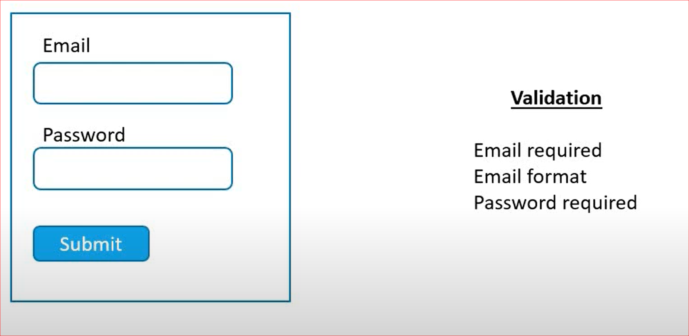

# Formik 

## What
 Formik is a small library that helps you deals with forms in React

## Why
  1. Managing form data
  2. Form submission
  3. Form validation and dispalaying error messages

## Login Form

<p align="center">
       
</p>

``` javascript 
import React from 'react'
import { Formik, Form } from 'formik'
import * as Yup from 'yup'
import FormikControl from './FormikControl'

function LoginFile() {

    const initialValues = {
        email: '',
        password: ''
    }

    const validationSchema = Yup.object({
        email: Yup.string().email('Invalid email format').required('Required'),
        password: Yup.string().required('required')
    })

    const onSubmit = values => {
        console.log('Form Data', values)
    }
    return (
        <Formik
            initialValues = { initialValues }
            validationSchema = { validationSchema }
            onSubmit = {onSubmit} 
        >
            {
                formik => {
                    return (
                        <Form>

                            <FormikControl  
                                control='input'
                                type='email'
                                label='Email'
                                name='email'
                            />

                            <FormikControl  
                                control='input'
                                type='password'
                                label='Password'
                                name='password'
                            />

                            <button type='submit' disabled={!formik.isValid}>Submit</button>

                        </Form>
                    )
                }
            }
        </Formik>
    )
}

export default LoginFile
```
## Registration Form

<p align="center">
       
</p>

``` javascript 

import React from 'react'
import { Formik, Form } from 'formik'
import * as Yup from 'yup'
import FormikControl from './FormikControl'

function RegistrationForm() {

    const option = [
        { key:'Email', value: 'emailmoc' },
        { key:'Telephone', value: 'telephonemoc' }
    ]

    const initialValues = {
        email: '',
        password: '',
        confirmPassword: '',
        modeOfContact: '',
        phone: ''
    }
    
    const validationSchema = Yup.object({
        email: Yup.string().email('Invalid Email Format').required('Required'),
        password: Yup.string().required('Required'),
        confirmPassword: Yup.string().oneOf([Yup.ref('password'), ''], 'Password Must Match').required('Required'),
        modeOfContact: Yup.string().required('Required'),
        phone: Yup.string().when('modeOfContact', {
            is: 'telephonemoc',
            then: Yup.string().required('Required')
        })
    })

    const onSubmit = values => {
        console.log('Form Data', values)
    }

    return (

        <Formik

            initialValues = { initialValues }
            validationSchema = { validationSchema }
            onSubmit = {onSubmit} 
        >
            {
                formik => {
                    return (
                        <Form>

                            <FormikControl  
                                control='input'
                                type='email'
                                label='Email'
                                name='email'
                            />

                            <FormikControl  
                                control='input'
                                type='password'
                                label='Password'
                                name='password'
                            />

                            <FormikControl  
                                control='input'
                                type='password'
                                label='Confirm Password'
                                name='confirmPassword'
                            />

                            <FormikControl  
                                control='radio'
                                label='Mode of Contact '
                                name='modeOfContact'
                                options={option}
                            />

                            <FormikControl  
                                control='input'
                                type='text'
                                label='Phone Number'
                                name='phone'
                            />

                            <button type='submit' disabled={!formik.isValid}>Submit</button>

                        </Form>
                    )
                }
            }
        </Formik>
    )
}

export default RegistrationForm
```

## Enrollment Form

<p align="center">
       
</p>

``` javascript 
import React from 'react'
import { Formik, Form } from 'formik'
import * as Yup from 'yup'
import FormikControl from './FormikControl'

function EnrollmentForm() {
    
    const dropdownOptions = [
        { key:'Select Your Option', value: '' },
        { key:'React', value: 'react' },
        { key:'Angular', value: 'angular' },
        { key:'Vue', value: 'vue' }
    ]

    const checkboxOptions = [
        { key:'HTML', value: 'html' },
        { key:'CSS', value: 'css' },
        { key:'JavaScript', value: 'javascript' }
    ]

    const initialValues = {
        email: '',
        bio: '',
        course: '',
        skills: [],
        courseDate: ''
    }
    
    const validationSchema = Yup.object({
        email: Yup.string().email('Invalid Email Format').required('Required'),
        bio: Yup.string().required('Required'),
        course: Yup.string().required('Required'),
        courseDate: Yup.date().required('Required').nullable()
    })

    const onSubmit = values => {
        console.log('Form Data', values)
    }

    return (

        <Formik

            initialValues = { initialValues }
            validationSchema = { validationSchema }
            onSubmit = {onSubmit} 
        >
            {
                formik => {
                    return (
                        <Form>

                            <FormikControl  
                                control='input'
                                type='email'
                                label='Email'
                                name='email'
                            />

                            <FormikControl  
                                control='textarea'
                                label='Bio'
                                name='bio'
                            />

                            <FormikControl  
                                control='select'
                                label= 'Course'
                                name='course'
                                options={dropdownOptions}
                            />

                            <FormikControl  
                                control='checkbox'
                                label='Your Skillset'
                                name='skills'
                                options={checkboxOptions}
                            />

                            <FormikControl  
                                control='date'
                                label='Course Date'
                                name='courseDate'
                            />

                            <button type='submit' disabled={!formik.isValid}>Submit</button>

                        </Form>
                    )
                }
            }
        </Formik>
    )

}

export default EnrollmentForm

```