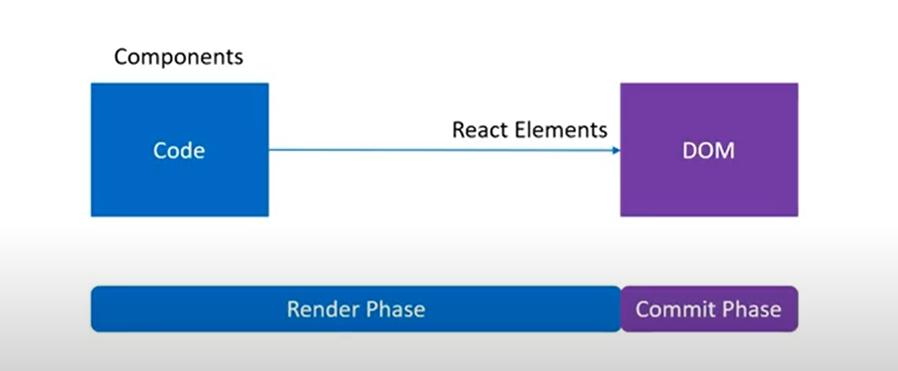
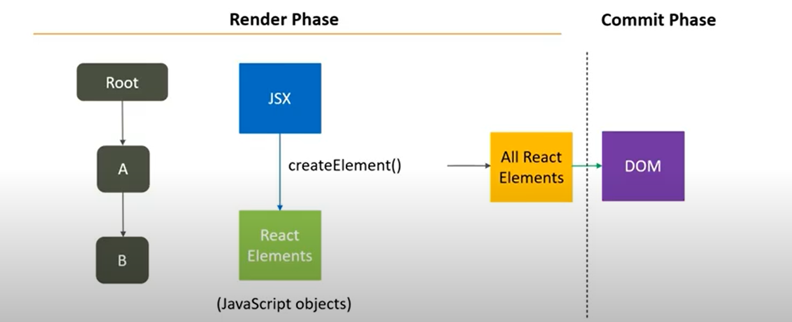
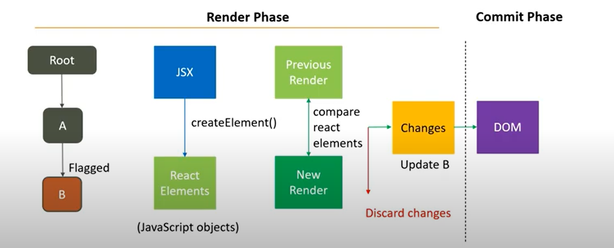
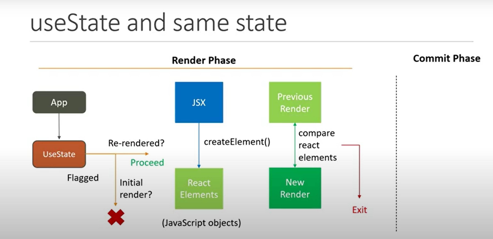
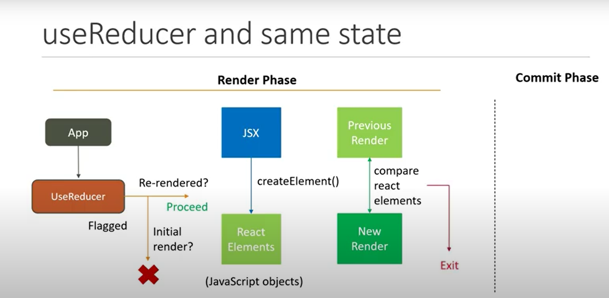
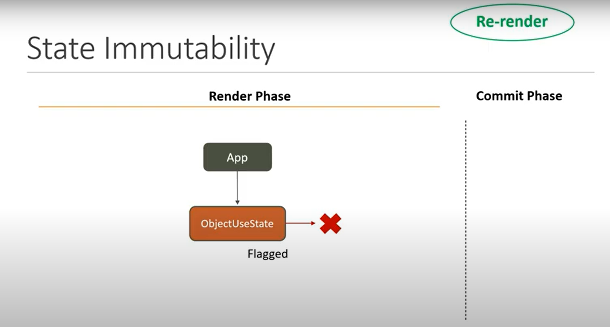
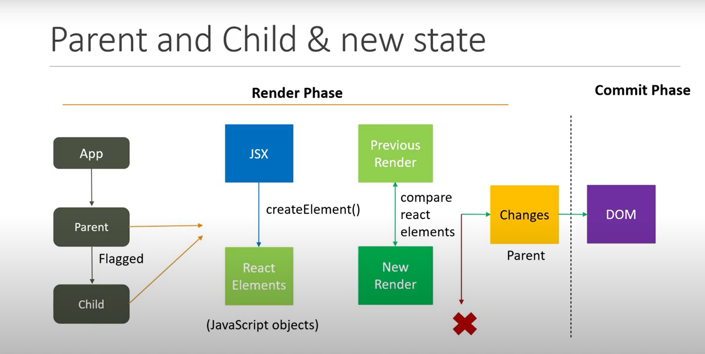
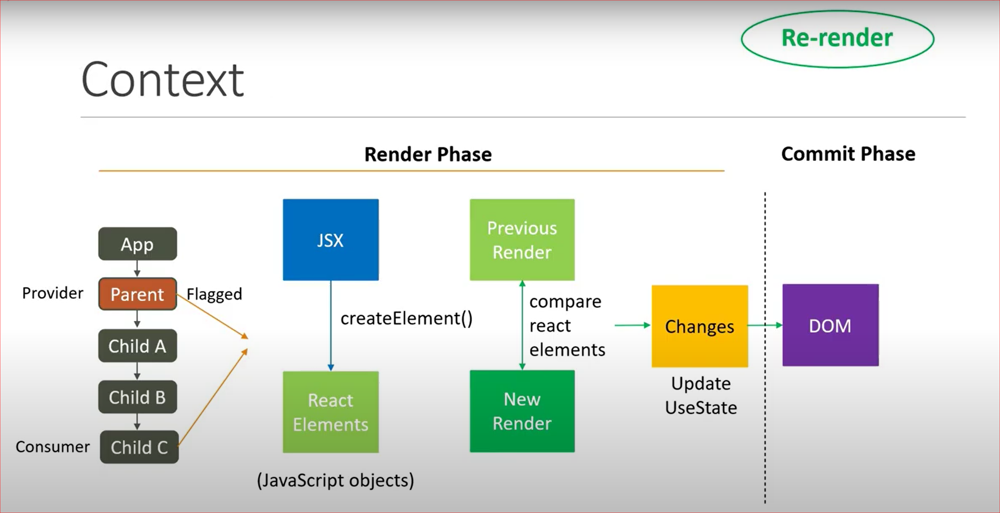

# React Render
   <p align="center">
       
   </p>

## Render Phase & Commit Phase
   <p align="center">
       
   </p>
   <p align="center">
       
   </p>

 * Render
    1. Find all elements flagged for update.
    2. For each flagged component, convert JSX to React element and store the result.
    3. Perform reconciliation - Diff old and new tree of React elements (Virtual DOM)
    4. Hand over the changes to the next phase
 * Commit
   1. Apply changes to the DOM

## useState and Render
   <p align="center">
       
   </p>

 1. The setter function from a useState hook will cause the component to re-render
 2. The exception is when you update a State Hook to the same value as the current state.
 3. Same value after the initial render?  The component will not re-render
 4. Same value after re-renders? React will render that specific component one more time and then bails out from any subsequent renders

## useReducer and Render
   <p align="center">
       
   </p>

 1. The dispatch function from a useReducer hook will cause the component to re-render
 2. The exception is when you update the state to the same value as the current state
 3. Same value after the initial render? The component will not re-render
 4. Same value after re-renders? React will render tht specific component one more time and then bails out from any subsequent renders

## State Immutability and Render
   <p align="center">
       
   </p>

 1. Mutating an object or an array as state will not cause a re-render when used with the useState or useReducer hook.
 2. To re-render, make a copy of the existing state, modify as necessary and then pass the new state to the setter function or while returning from a reducer function.
      ```java 
         const [person, setPerson] = useState(initState)

         const changeName = () => {
            // Object are not re-render
            
            // person.fname = 'Clark'
            // person.lname = 'Kent'
            // setPerson(person)

            const newPerson = {...person}
            newPerson.fname = 'Clark'
            newPerson.lname = 'Kent'
            setPerson(newPerson)
         }

         console.log('ObjectUseState Render')
         return (
            <div>
                  <button onClick={changeName}>{person.fname} {person.lname}</button>
            </div>
         )
      ```
## Parent Child and Render
   <p align="center">
       
   </p>

 1. When a parent component renders, React will recursively render all of its child components.
 2. New State same as old state after initial render? Both parent and child do not re-render
 3. New state same as old state after re-renders? Parent re-renders one more time but child never re-renders.

## Context and Render
   <p align="center">
       
   </p>

 When the context provider is in the parent component and the parent component's state updates, every child component re-renders and not just the component consuming the context value

## Render Optimization
When you optimize the rendering of one component, React will also skip rendering that component's entire subtree because it's effectively stopping the default `render children recursively`  behavior of React.

#### Same element reference
 1. In React, when a parent component renders, React will recursively render all of its child components.
 2. "Unnecessary renders" where the child component goes through the render phase but not to commit phase.
 3. You can extract the expensive child component and instead pass it down as props to the parent component.
 4. Whenever there is a re-render caused by a change in the state of the parent component, React will optimize the re- render for you  by knowing that the props has to be referencing the same element before and after the render

#### Memo and Render
 1. In React, when a parent component renders, a child component might un-necessarily render.
 2. To optimize this behavior, you can use React.memo and pass in the child component.
 3. React.memo will perform a shallow comparison of the previous and new props and re-render the child component only if the props have changed
 4. If the child having props data type like object or function and that props wont get change while parent render, it will re-render the child. To avoid re-render `useMemo()` for object and `useCallback()` for functional props.
